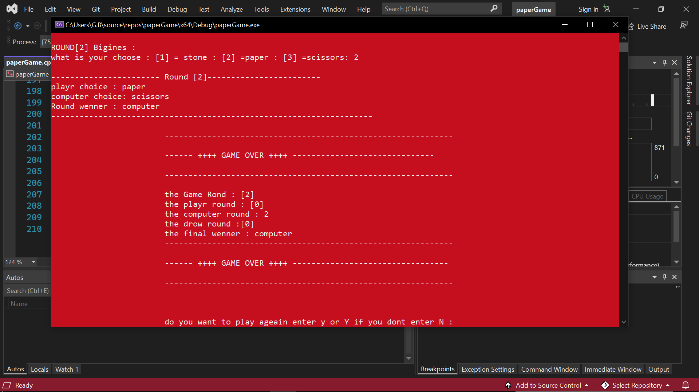
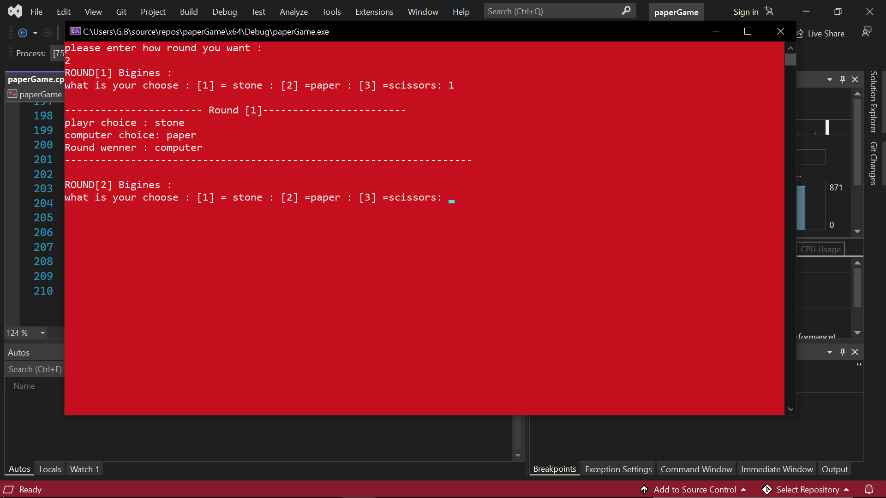

# ✊📄✂️ Rock Paper Scissors Game in C++ | لعبة حجرة ورقة مقص بلغة C++

لعبة تفاعلية كلاسيكية تم بناؤها باستخدام لغة **C++** وتقنية **الكونسول (Console)**، تتيح للمستخدم التحدي ضد الكمبيوتر في جولات مشوّقة من "حجرة، ورقة، مقص"!

---

## 🎯 فكرة اللعبة

اللعبة تعمل وفق الخطوات التالية:

1. يسألك النظام: "كم عدد الجولات التي ترغب بلعبها؟"
2. في كل جولة:
   - تختار أنت: ✊ حجرة | 📄 ورقة | ✂️ مقص (عبر رقم 1 أو 2 أو 3)
   - يختار الكمبيوتر بشكل عشوائي إحدى الثلاثة
   - يتم مقارنة الاختيارات وتحديد الفائز في الجولة
3. بعد انتهاء كل الجولات:
   - يتم عرض النتيجة النهائية
   - عدد مرات فوز اللاعب
   - عدد مرات فوز الكمبيوتر
   - عدد مرات التعادل 🤝

---

## 🧠 الميزات

- 🔢 تحديد عدد الجولات قبل بدء اللعب
- 🧠 اختيار عشوائي ذكي من الكمبيوتر
- 🧮 عدّ وإحصاء النتائج النهائية بشكل تلقائي
- 🖥️ واجهة بسيطة وسريعة باستخدام الكونسول
- 🧱 برمجة نظيفة قابلة للتوسعة

---

## 🛠️ التقنيات المستخدمة

| التقنية | الاستخدام |
|---------|------------|
| 💬 C++  | اللغة الأساسية |
| 💻 Console I/O | للتفاعل مع المستخدم |
| 🎲 Random Number Generator | لاختيار حركة الكمبيوتر |
| 🔁 Loops & Conditions | لتنظيم الجولات والمقارنة |

---

## 📸 صور من داخل اللعبة

## ⚙️ طريقة التشغيل

1: افتح المشروع باستخدام محرر C++ (مثل Code::Blocks، VS Code، أو Visual Studio).

2: تأكد أن ملف main.cpp موجود في المجلد الرئيسي.

3: شغّل الكود.

4: أدخل عدد الجولات.

5: اختر حركتك في كل جولة باستخدام الأرقام التالية:

1 → ✊ حجرة

2 → 📄 ورقة

3 → ✂️ مقص

6: تابع النتيجة بعد كل جولة حتى إعلان الفائز النهائي!

## ⭐ دعم المشروع

ذا أعجبتك اللعبة أو ساعدتك في تعلّم C++،
لا تنسَ الضغط على زر ⭐ أعلى الصفحة لدعمي ومشاركة المشروع مع الآخرين!
كل نجمة تفرق معي كثير 💙

## 🧑‍💻 المطوّر

تم تطوير هذه اللعبة بشغف ضمن رحلة تعلم C++
كوسيلة لتطبيق المفاهيم الأساسية مثل التكرار، الشروط، العشوائية، وتنظيم الكود بأسلوب عملي.

💬 هل عندك فكرة أو تعديل؟
افتح Issue أو Pull Request على GitHub!
